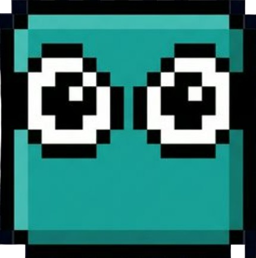
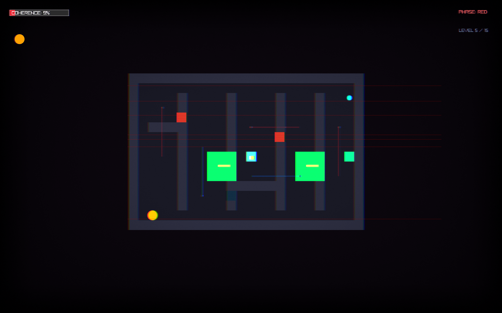

# 🌀 Phase Shift — Quantum Puzzle Game

<p align=center>
  
</p>

> *"Tu conciencia está entrelazada cuánticamente con un acelerador de partículas..."*


**Phase Shift** es un juego de puzzles 2D basado en mecánicas cuánticas reales. Creaado para la **Quantum Computing Game Jam**. Eres el **Sujeto 44**, un científico atrapado en un experimento cuántico fallido. Tu conciencia existe en múltiples fases de la realidad simultáneamente. Completa **20 niveles** de puzzles cuánticos antes de que tu coherencia cuántica colapse permanentemente.

Las probabilidades cuánticas del juego (túneles cuánticos, superposición) se calculan mediante un servidor ejecutando **IBM Qiskit**, conectando la jugabilidad con circuitos cuánticos reales.

Desarrollado por **Kripta Studios** · Motor: [Raylib](https://www.raylib.com/) · Lenguaje: C99

---

## 📸 Capturas de Pantalla


*Explorando el laberinto cuántico y usando fases*


*Resolviendo puzzles con superposición y entrelazamiento*


*Enfrentarse a enemigos cuánticos*
---

## 🎮 Controles

| Tecla | Acción |
|-------|--------|
| `W/A/S/D` o `↑←↓→` | Movimiento (basado en turnos) |
| `Z` | Cambiar de fase cuántica |
| `ESPACIO` | Activar Superposición / Crear Eco |
| `X` o `SHIFT IZQ` | Plantar bomba |
| `T` o `.` | Esperar (pasar turno sin moverse) |
| `E` | Interactuar (Portales / Entrelazamiento) |
| `H` | Enciclopedia cuántica |
| `ENTER` | Avanzar diálogos / Reintentar nivel |
| `ESC` | Menú de pausa |
| `=` / `-` | Zoom in / out |

---

## 🔬 Mecánicas Cuánticas

### 1. Sistema de Fases (`Z`)

El jugador cambia entre fases de la realidad. Cada fase atraviesa muros del color **opuesto**:

| Fase | Atraviesa | Bloqueado por |
|------|-----------|---------------|
| 🔴 Roja | Muros AZULES | Muros ROJOS |
| 🔵 Azul | Muros ROJOS | Muros AZULES |
| 🟢 Verde | Muros AMARILLOS | Muros VERDES |
| 🟡 Amarilla | Muros VERDES | Muros AMARILLOS |

> Las fases Verde y Amarilla se desbloquean con el item **Desbloqueo de Fase**.

### 2. Superposición Cuántica (`ESPACIO`)

Activa la superposición para crear un **Eco Cuántico**:

1. **Posiciónate** donde quieras que actúe tu Eco (ej. sobre un botón)
2. **Pulsa ESPACIO** para empezar a grabar
3. **Usa [T]** para esperar turnos sin moverte
4. **Muévete** hacia tu objetivo mientras la grabación se registra
5. El **Eco** aparece y repite tus acciones en bucle

> La probabilidad de éxito de la superposición se calcula mediante circuitos de **Qiskit**.

### 3. Detectores Cuánticos

Láseres que solo detectan UNA fase:
- **Detector ROJO** te detecta si estás en fase ROJA
- **Detector AZUL** te detecta si estás en fase AZUL
- Detección = pérdida de coherencia + bloqueo de fase

### 4. Portales Cuánticos

Celdas brillantes que te teletransportan:
- Cada portal tiene una **fase** asignada
- Debes estar en la **misma fase** que el portal para usarlo
- Los portales están enlazados en **parejas**

### 5. Túneles Cuánticos

Zonas púrpuras que te permiten atravesar muros:
- **50%** de probabilidad de éxito (calculada via Qiskit)
- Si fallas: turnos atrapado + pérdida de coherencia
- Solo funciona al activar superposición en la zona

### 6. Entrelazamiento (`E`)

Pulsa `E` cerca de un Colapsor (enemigo) para entrelazarte:
- Tu movimiento se transfiere al enemigo entrelazado
- El enemigo se mueve **igual que tú**
- Útil para posicionar enemigos sobre botones

### 7. Coherencia Cuántica (Barra de Vida)

| Acción | Efecto |
|--------|--------|
| Decaimiento natural | -1% cada 5 turnos |
| Zona de decoherencia | -2% extra por turno |
| Detección | -15% |
| Partícula de coherencia | +5% |
| Checkpoint | Restauración completa |
| Coherencia = 0% | **Muerte** |

---

## 🗺️ Guía de los 15 Niveles

### Nivel 1 — INTERFERENCIA
**Concepto:** Introducción al cambio de fase

Muros rojos y azules forman un patrón de interferencia. Cambia de fase con `Z` para atravesar los muros del color opuesto. Recoge la llave, abre la puerta y llega a la salida.

---

### Nivel 2 — ZIGZAG DE FASE
**Concepto:** Cambio de fase obligatorio en zigzag

Tres barreras verticales de fase (ROJA → AZUL → ROJA) con aperturas en extremos opuestos fuerzan un recorrido en zigzag. La salida está protegida por muros de fase.

---

### Nivel 3 — PARADOJA TEMPORAL
**Concepto:** Uso de Ecos Cuánticos para abrir barreras

Dos botones ROJOS cercanos deben pulsarse simultáneamente para abrir la barricada. Usa un Eco para mantener un botón mientras pisas el otro.

**Solución:**
1. Ve al botón de ARRIBA en fase ROJA
2. Pulsa `ESPACIO` para iniciar grabación del Eco
3. Espera con `T` 3-4 turnos
4. Corre al botón de ABAJO. Tu Eco mantiene el primero
5. Alternativa: usa bombas (`X`) para romper barricadas

---

### Nivel 4 — COMPUERTA HADAMARD
**Concepto:** Dos botones simultáneos con Eco

Forma de "H" con muros de fase. Dos botones deben pulsarse a la vez para abrir la barricada.

---

### Nivel 5 — GROVER
**Concepto:** Búsqueda cuántica en laberinto con guardias

Laberinto denso con muros verticales, detectores y guardias. Cambia de fase para cruzar aperturas de color y evita detectores con la fase opuesta.

---

### Nivel 6 — TELETRANSPORTE
**Concepto:** Túneles cuánticos entre zonas aisladas

Tres zonas separadas por muros dobles. Solo los túneles cuánticos (zonas púrpuras) conectan las zonas.

---

### Nivel 7 — CORRECCIÓN DE ERRORES
**Concepto:** Tres corredores con diferentes peligros

Tres corredores paralelos, cada uno con un tipo de "ruido" cuántico diferente.

---

### Nivel 8 — SUPREMACÍA
**Concepto:** Todas las mecánicas combinadas en 3 zonas

Mapa grande con tres zonas: laberinto de fase, detectores y botones, y escape con túnel.

---

### Nivel 9 — COMPUERTA TOFFOLI
**Concepto:** Desbloqueo de fase verde + botones duales

La salida está bloqueada por muros VERDES. Dos botones deben pulsarse simultáneamente.

---

### Nivel 10 — TELEPORTACIÓN
**Concepto:** Portales cuánticos con fase requerida

Tres islas separadas por muros. Los portales cuánticos son la ÚNICA forma de moverse entre islas.

---

### Nivel 11 — LABERINTO DE FASE
**Concepto:** Muros ROJOS y AZULES en laberinto

Cambia de FASE para atravesar muros. Evita al guardia del centro. Recoge la LLAVE y abre la PUERTA.

---

### Nivel 12 — ECO Y GUARDIA
**Concepto:** Botones con guardias y bombas

Un muro de barricadas bloquea el paso. El botón abre la barricada. Un guardia patrulla al otro lado.

---

### Nivel 13 — DOS BOTONES
**Concepto:** Eco para botones simultáneos

Dos botones deben pulsarse A LA VEZ para abrir la barricada. Usa superposición y eco.

---

### Nivel 14 — PORTALES Y FASE
**Concepto:** Portales entre secciones con fase requerida

Tres secciones conectadas por portales. Necesitas la llave de la sección 2.

---

### Nivel 15 — PRUEBA FINAL
**Concepto:** Prueba final del primer bloque
Combina muros de fase, botones, guardias y ecos. Usa todo lo que has aprendido.

---

### Nivel 16 — GROVER II
**Concepto:** Superposición avanzada
Laberinto complejo con detectores y muros variables. Requiere uso preciso de Superposición y cambio de fase.

---

### Nivel 17 — ENTRELAZAMIENTO
**Concepto:** Introducción a la mecánica de Entrelazamiento (`E`)
El guardia está encerrado con un botón necesario para salir. Entrelázate con él (`E`) y guía sus movimientos para que pise el botón por ti.

---

### Nivel 18 — ORÁCULO
**Concepto:** Búsqueda en 4 cámaras
Cuatro cámaras idénticas. Una contiene la llave, las otras señuelos o peligros. Usa superposición para explorar sin arriesgar tu cuerpo físico.

---

### Nivel 19 — EJECUCIÓN FINAL
**Concepto:** El desafío definitivo
Tres botones dispersos, múltiples guardias y muros de fase oscilantes. Debes coordinar Ecos, Entrelazamiento y Bombas para escapar.

---

## 🔧 Integración con Qiskit

Phase Shift utiliza un servidor backend ejecutando **IBM Qiskit** para calcular probabilidades cuánticas reales. Los siguientes elementos del juego están conectados con circuitos cuánticos:

- **Túneles Cuánticos**: La probabilidad de traversar un muro se calcula mediante un circuito Hadamard + medición
- **Superposición**: La dualidad onda-partícula se simula con qubits reales
- **Decoherencia**: La pérdida de coherencia sigue modelos de ruido cuántico

---

## 🔨 Compilación

### Dependencias

- **GCC** (compilador C99)
- **Raylib** 5.0+ (incluido como .dll en Windows)
- **GNU Make** (opcional)

### Compilar

```bash
# Con Make (recomendado)
make clean
make
./phase_shift.exe

# Manualmente (Windows MinGW)
gcc -O3 -Wall -Wno-missing-braces -std=c99 -I. -Isrc -L. -o phase_shift.exe \
  src/main.c src/utils.c src/logic.c src/render.c src/levels.c \
  src/menus.c src/persistence.c src/atmosphere.c src/quantum.c \
  -lraylib -lopengl32 -lgdi32 -lwinmm
```
### Modo Release
Compila el ejecutable con optimizaciones:
```bash
make release
```
```bash
make release-linux
```
---

## 🧬 Arquitectura del Código

| Archivo | Propósito |
|---------|-----------|
| `src/main.c` | Bucle principal, gestión de estados |
| `src/common.h` | Structs, enums, constantes globales |
| `src/utils.c/h` | Mapa, colisiones, paleta, pathfinding |
| `src/logic.c/h` | Turnos, IA, física cuántica, ecos |
| `src/render.c/h` | Renderizado visual, HUD, efectos |
| `src/levels.c/h` | Definición y carga de 19 niveles |
| `src/menus.c/h` | Menú principal y pausa |
| `src/persistence.c/h` | Guardado/cargado de progreso |
| `src/atmosphere.c/h` | Estrellas, átomos decorativos |
| `src/quantum.c/h` | Qubits, puertas cuánticas, portales |

---

## 🎵 Créditos

- **Motor**: [Raylib](https://www.raylib.com/) by Ramon Santamaria
- **Música**: Type 42 — [SoundCloud](https://soundcloud.com/type42) · [YouTube](https://www.youtube.com/@Type42) · [Bandcamp](https://type42.bandcamp.com/)
- **Desarrollo**: Kripta Studios

---

## 📄 Licencia

Ver [LICENSE.txt](./LICENSE.txt)

